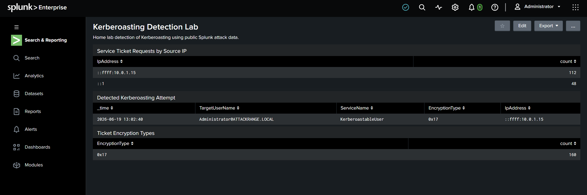
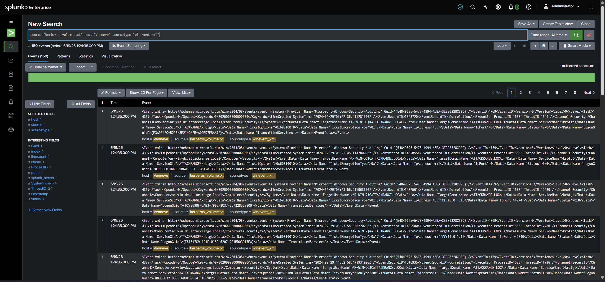
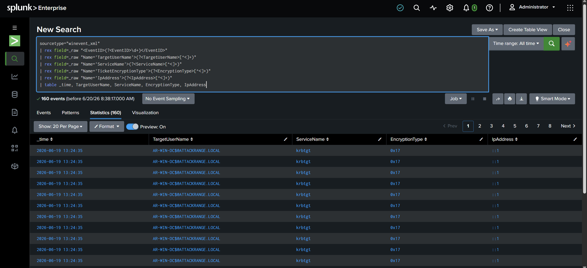
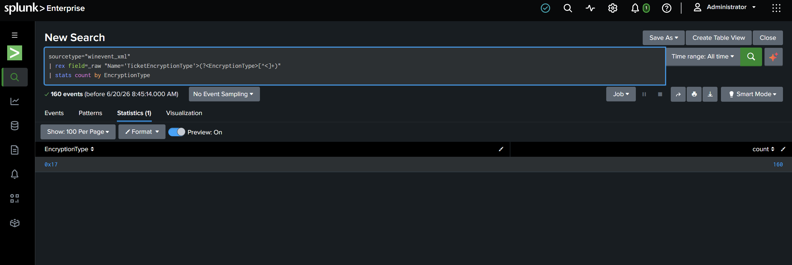
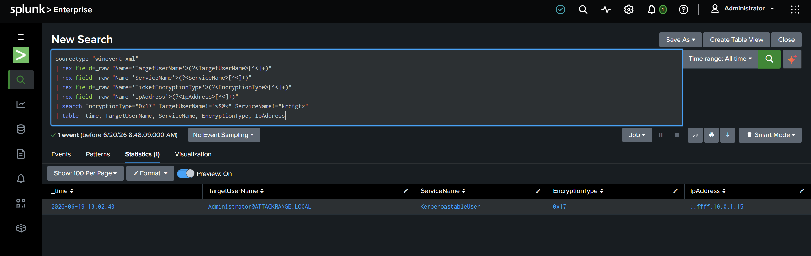
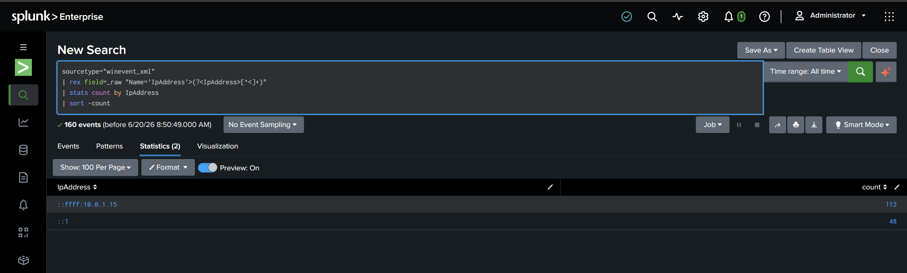

# Kerberoasting Detection Lab (Splunk)

A hands-on home lab where I ingested public Windows Kerberos logs into Splunk and built searches and a dashboard to detect Kerberoasting (MITRE ATT&CK T1558.003).

> **Scope:** This is a personal learning lab built on public attack datasets. It is not a real-world incident, not production monitoring, and not work experience. The logs were generated in Splunk's public attack range and published for testing detections.



## Overview

Kerberoasting is a common Active Directory attack where an attacker requests Kerberos service tickets for service accounts, then cracks them offline to recover the account password. The requests look like normal authentication traffic, so the challenge for a defender is separating the malicious request from everyday noise.

In this lab I loaded around 160 Windows Security event 4769 records (Kerberos service ticket requests) into a local Splunk instance, then wrote a small set of searches that isolate the single Kerberoasting attempt hidden among the normal-looking traffic, and confirmed it from a second angle using request volume.

## What is Kerberoasting?

When a user wants to access a service in an Active Directory domain, they request a service ticket from the domain controller. That request is logged as Windows event ID 4769. The ticket is encrypted with the service account's password hash. An attacker who can request these tickets can take them offline and try to crack the password at their own pace.

Two signals make a request suspicious:

* **Weak encryption.** Attackers often force RC4 (encryption type `0x17`) because RC4 tickets are easier to crack than modern AES (`0x12`).
* **The target.** A normal user account requesting a ticket for a service account is the classic pattern, as opposed to routine machine-to-`krbtgt` traffic.

## Lab Environment

| Component | Detail |
|-----------|--------|
| SIEM | Splunk Enterprise (free), running locally on Windows |
| Data source | Two public datasets from Splunk's `attack_data` repository |
| Technique | MITRE ATT&CK T1558.003 (Kerberoasting) |
| Event type | Windows Security event ID 4769 (Kerberos service ticket request) |
| Total events | ~160 |

**Ingestion notes:** I uploaded the raw XML logs through Splunk's Add Data wizard using a custom sourcetype (`winevent_xml`) with event breaking set to "every line", since the official Windows add-on sourcetype was not available in my install. Because of that, I extracted the relevant fields at search time with `rex` rather than relying on built-in field extractions.

## Data

The events come from Splunk's public [attack_data](https://github.com/splunk/attack_data) repository, under technique T1558.003:

* `kerberoasting_spn_request_with_rc4_encryption` (the targeted roast)
* `unusual_number_of_kerberos_service_tickets_requested` (request volume)

These are curated attack datasets, so they contain more malicious activity than a normal network would. I have kept that in mind in the findings below.

## Detection Walkthrough

All searches were run over **All time**.

### 1. Make the raw logs readable

The events arrive as raw Windows XML. The first step extracts the fields I care about into clean columns.

```spl
sourcetype="winevent_xml"
| rex field=_raw "<EventID>(?<EventID>\d+)</EventID>"
| rex field=_raw "Name='TargetUserName'>(?<TargetUserName>[^<]+)"
| rex field=_raw "Name='ServiceName'>(?<ServiceName>[^<]+)"
| rex field=_raw "Name='TicketEncryptionType'>(?<EncryptionType>[^<]+)"
| rex field=_raw "Name='IpAddress'>(?<IpAddress>[^<]+)"
| table _time, TargetUserName, ServiceName, EncryptionType, IpAddress
```

Raw 4769 events as ingested:



The same data after field extraction:



### 2. Baseline the encryption types

```spl
sourcetype="winevent_xml"
| rex field=_raw "Name='TicketEncryptionType'>(?<EncryptionType>[^<]+)"
| stats count by EncryptionType
```



Every one of the 160 requests used RC4 (`0x17`). In a healthy production environment most tickets would be AES (`0x12`), so a heavy share of RC4 is itself worth flagging. (Here the figure is 100% because this is curated attack data, not a live network.)

### 3. Isolate the Kerberoasting attempt

This filters out the routine machine-to-`krbtgt` traffic and surfaces the one request that fits the classic roast pattern: a real user account requesting a non-`krbtgt` service account ticket with weak encryption.

```spl
sourcetype="winevent_xml"
| rex field=_raw "Name='TargetUserName'>(?<TargetUserName>[^<]+)"
| rex field=_raw "Name='ServiceName'>(?<ServiceName>[^<]+)"
| rex field=_raw "Name='TicketEncryptionType'>(?<EncryptionType>[^<]+)"
| rex field=_raw "Name='IpAddress'>(?<IpAddress>[^<]+)"
| search EncryptionType="0x17" TargetUserName!="*$@*" ServiceName!="krbtgt*"
| table _time, TargetUserName, ServiceName, EncryptionType, IpAddress
```



One event out of 160 survives the filter: the `Administrator` account requesting a ticket for the `KerberoastableUser` service account with RC4, from `10.0.1.15`.

### 4. Confirm from the volume angle

A second, independent method: which source is making the most ticket requests?

```spl
sourcetype="winevent_xml"
| rex field=_raw "Name='IpAddress'>(?<IpAddress>[^<]+)"
| stats count by IpAddress
| sort -count
```



`10.0.1.15` accounts for 112 of the requests, far more than anything else. That is the same IP the targeted detection flagged in step 3, so two different methods point at the same source.

## Findings

1. **100% RC4 encryption.** All 160 ticket requests used the weak RC4 (`0x17`) cipher, which is a hallmark of Kerberoasting tooling.
2. **One clear roast.** Filtering for RC4 by non-computer accounts against non-`krbtgt` services isolated a single event: the `Administrator` account targeting the `KerberoastableUser` service account from `10.0.1.15`.
3. **Corroborated by volume.** The same source IP (`10.0.1.15`) generated the bulk of the request volume, supporting the targeted finding from a second angle.

## Notes and Limitations

* This is a small, curated dataset, so the detection logic is intentionally simple. In a production environment, filtering out all computer accounts and `krbtgt` would need tuning to avoid missing real activity or raising false positives, and RC4 would be the minority of traffic rather than all of it.
* The field extractions use `rex` because I ingested the raw XML with a custom sourcetype. With the official Windows add-on, fields like `EventCode` and `TicketEncryptionType` would be extracted automatically.

## What I Learned

* How Kerberoasting appears in Windows 4769 logs, and why encryption type and the requesting account matter.
* Splunk data onboarding: sourcetypes, event breaking, and why the wrong breaking setting merged 159 events into one until I set it to "every line".
* Writing SPL: base search, `rex` field extraction, `stats`, filtering with `search`, and building a dashboard from saved searches.

## References

* [Splunk attack_data repository](https://github.com/splunk/attack_data)
* [MITRE ATT&CK T1558.003 (Kerberoasting)](https://attack.mitre.org/techniques/T1558/003/)
* Windows Security event ID 4769 (Kerberos service ticket requested)

---

*Built as a personal learning project. All data is public and synthetic; no real systems were monitored.*
